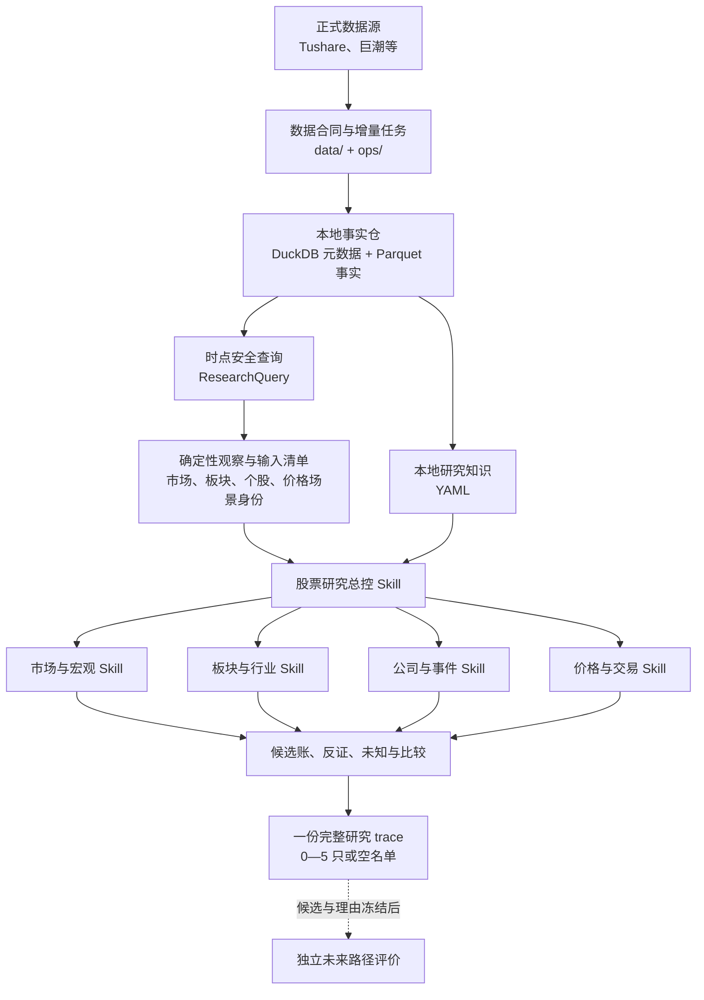

# 股票分析助手 V3：当前架构与实现状态

**更新日期：** 2026-08-21

**适用范围：** GitHub `main` 分支

**用途：** 帮助 ChatGPT、Codex 和维护者准确理解当前项目，而不是从旧 V3 历史反推现状

**状态：** 当前架构总览；具体事实合同以代码为准，具体研究方法以仓库 Skill 为准

## 1. 一句话结论

这是一个面向个人 A 股研究的“确定性本地数据底座 + 本地研究知识 + 五个研究 Skill”项目：

> 程序负责取得、保存、回放和计算事实；AI/Skill 负责提出研究问题、解释证据、比较候选、寻找反证并作出 0—5 只的条件化取舍。

项目不连接券商、不自动交易、不决定仓位、不承诺收益，也没有一个可独立运行的程序化选股器。

## 2. 当前权威来源

阅读或修改项目时，按以下顺序理解当前状态：

1. `AGENTS.md`：仓库级协作规则和不可违反的研究边界；
2. 本文：当前系统结构、实现状态和历史设计的去留；
3. `.agents/skills/orchestrating-stock-research/SKILL.md`：最终研究流程和输出合同；
4. 四个专业 Skill：市场、板块、公司、价格各自的方法和边界；
5. `src/stock_analyzer/`：已经实现的事实、存储、查询和派生观察能力，以及供 Skill 调阅的 YAML 知识内容；
6. `docs/` 下的诊断报告：历史模拟和调优证据，不是永久规则。

`docs/superpowers/specs/2026-08-04-skill-first-stock-research-architecture-design.md` 记录从旧 V3 清理到 Skill 先行架构的过渡过程，具有历史价值，但其中“尚未创建 Skill”等状态已经过时。出现冲突时，以当前代码、当前五个 Skill 和本文为准。

## 3. 系统边界

### 3.1 目标

在严格的形成日信息边界内，从可研究股票范围中选择 0—5 只未来约 20 个交易日更可能形成可操作显著上涨路径、重点观察能否达到约 20% 涨幅的股票。

“20 日约 20%”是用户目标和候选冻结后的评价标签，不是固定涨幅阈值、总分、收益承诺或程序筛选公式。

### 3.2 默认股票范围

- 上海主板；
- 深圳主板；
- 创业板；
- 排除科创板、北交所、场内基金、ST/\*ST、退市整理、停牌、无可靠报价及行动日明确无法正常参与的股票。

用户明确指定其他范围时，以用户要求为准，但必须保留可交易性和数据身份检查。

### 3.3 明确不做

- 不连接券商或自动下单；
- 不生成仓位或自动止盈止损；
- 不承诺收益；
- 不用固定总分、权重、Gate、行业配额或候选数量补位；
- 不把量价推断成“主力”“机构”或其他交易主体身份；
- 不用形成日之后的信息解释或修改形成日选择；
- 不恢复已经从 `main` 删除的旧 V3 评分、关注池、报告发布、Supabase 或 Cloudflare 路径。

## 4. 当前系统结构



这不是四个专业 Skill 投票或四道 Gate。正式入选必须说明形成日短期上涨发动机：新信息或新需求如何形成板块传播或股票需求，如何得到相对市场和行业的价格成交确认，以及路径为何仍未耗尽；公司催化、基本面锚、传播、价格确认和公司风险分别记录。市场或板块可以逆风，但公司业绩、估值、现金流、低位或材料完整度不能单独替代发动机。

## 5. 程序层：已经实现的确定性能力

### 5.1 数据合同与来源治理

`src/stock_analyzer/data/research_contracts.py` 为行情、复权、估值、涨跌停、指数、行业、主题、公司资料、财务、公告、股东事件、交易结构等数据定义：

- 业务键和分区字段；
- 允许的数据源；
- 必需字段和质量要求；
- `available_at` 语义；
- 修订版本和历史回放级别；
- 数据不足时的失败关闭边界。

数据记录保留来源、获取时间、可用时间、内容哈希、业务键哈希和质量状态。程序不把“后来知道的正确版本”倒填到更早形成日。

### 5.2 本地事实仓

`src/stock_analyzer/storage/research_warehouse.py` 使用 DuckDB 保存元数据、使用 Parquet 保存事实分区，并提供：

- 原子提交和文件锁；
- 内容哈希与文件 SHA-256 核对；
- 业务键去重和修订记录；
- 中断恢复与一致性检查；
- 分区清单和数据质量状态。

真实数据位于被 Git 忽略的 `local_warehouse/`。GitHub 只包含程序、合同、知识和文档，不包含本地行情、财务、公告正文、密钥或个人运行产物。

### 5.3 形成日安全查询

`src/stock_analyzer/storage/research_query.py` 的 `ResearchQuery` 按带时区的 `as_of` 解析形成日可见版本，并能够生成包含分区内容哈希和已解析行哈希的 `input_manifest`。

这使历史模拟能够说明“当时实际可见什么”，而不是只按业务日期过滤当前快照。若时间无时区、分区缺失、修订关系冲突或关键数据不可靠，程序应失败关闭或显式标注限制。

### 5.4 确定性派生观察

`src/stock_analyzer/analysis/` 和 `src/stock_analyzer/ops/research_features.py` 当前生成四类无最终选股权的观察：

- `market_context`：市场收益、广度、波动、集中等连续事实；
- `sector_hotspot`：行业/主题共同表现、成员广度、集中和分化；
- `stock_trading_context`：个股相对表现、价格位置、成交和交易质量。
- `price_analysis_context`：按价格 Skill 六个信息维度生成原始路径、相对市场、相对形成日有效申万二级行业、趋势、路径效率、振荡、波动、收盘/成交质量、长期位置和参与条件，并用冻结阈值确定性分配 11 个场景的 case/control 身份与 20% 目标 ATR 距离。

`price_analysis_context` 使用本地复权行情并严格截断在形成日，至少保留 251 个会话以计算前 250 日高点。程序只计算场景身份和原始值，不解释场景对候选的作用，也不把 MACD、RSI、K/D、BOLL、ADX/DMI、EMA、行业百分位或 ATR 距离变成评分、排名和 Gate。暂定场景的支持、反证和比较权限留在价格 Skill 中，不写成 Python 判断。派生任务记录公式版本与输入清单；输入未变时可以校验并跳过重算。

`analysis/event_reaction_features.py` 另提供按需纯计算：对 AI 已选定且形成日可见的公司事件，按盘前或盘后对齐首个完整交易日，计算事件前 5 日和事件后 1/3/5 个交易日的绝对收益、相对宽基市场、相对形成日有效申万二级行业及成交额比。输入即使含未来行也截断在 `analysis_date`；窗口不足明确返回 `partial` 或 `awaiting_first_session`。它不判断事件语义、方向或股票去留，不落新派生表、不增加定时任务。

### 5.5 本地研究知识

`src/stock_analyzer/knowledge/` 保存研究方法、适用范围、禁止用途、反证和本地验证结果。五个 Skill 按当前问题直接调阅相关 YAML，不经过程序化选择器、评分或 Gate。

知识条目帮助 AI 决定如何研究，不直接产生股票结论。标记为历史、能力不完整或禁止用于收益方向的知识，不能换一种表述重新成为评分规则。

### 5.6 数据任务

CLI 当前只提供数据底座命令：

```text
data backfill
data run-stage
data derive
data health
```

`ops/launchd/` 保留收盘、晚间和次晨三个数据任务模板。它们只更新本地事实、派生观察和健康摘要，不运行最终选股、不发布报告、不交易。

交易日上午约 09:05 的最终研究由 Codex 原生 Scheduled Task 在当前项目中直接调用 `$orchestrating-stock-research`，总控在同一个顶层会话内使用四个专业 Skill；仓库代码不通过 Python 启动第二个 Codex，也没有第四个 AI LaunchAgent。`prepare` 冻结上一交易日、行动日和带时区的 `as_of`，等待次晨数据并结算到期 D20；Codex 只生成 `pending-trace-<formation_date>.json` 一份 `daily-research-trace-v2` 完整轨迹；`record-trace` 只校验结构、日期、合格股票、候选守恒、唯一决定引用及入选命题的公司/价格角色一致性，从其中抽取现有 `ResearchResult` 调用 `record_daily_selection`，写入现有 Forward CSV 后将完整轨迹原子归档为 `research-trace-<formation_date>.json`。程序不判断发动机、传播或价格解释是否正确。现有 `record` 命令、`ResearchResult`、Forward CSV 字段和 D20 结算保持不变；完整 trace 不写入 DuckDB。

研究超过 18 分钟或 09:30 后完成仍可保存，只要冻结的 `as_of` 早于行动日 09:30，且所有行情交易日期不晚于形成日、所有事实满足 `available_at <= as_of`。合规结果统一按 `selection` 语义写入被 Git 忽略的 `local_archive/forward_selection/forward-selection-log.csv`；历史 `validation_mode` 只为 CSV 兼容保留，不再形成 forward/reconstructed 两套推荐。历史记录首次由 `docs/forward-selection-log.csv` 初始化，之后只在 D1—D20 行情完整时一次性结算。

`select_minute_candidate_scope` 中的确定性排序只用于限制可选分钟数据的采集范围，属于数据成本控制，不是投资评分或最终候选排名；分钟数据也不是目标架构的每日必需输入。

## 6. AI 层：五个仓库 Skill

### 6.1 股票研究总控

`.agents/skills/orchestrating-stock-research/` 承担最终研究组织和取舍：

- 冻结 `formation_date`、`action_date`、带时区 `as_of`、股票范围和研究目标；
- 让四个专业 Skill 分别发现和验证线索；
- 按上涨因果链合并候选，而不是按分数排序；
- 按“新信息或新需求 → 板块传播或股票需求 → 相对市场和行业的价格成交确认 → 剩余路径 → 基本面锚和公司风险”组织判断；
- 维护紧凑 `candidate_ledger` 和 `decision_trace`，将公司催化、短期发动机、传播、价格确认、剩余路径、基本面锚、公司风险与关键未知分开记录；
- 区分关键未知与次要未知；
- 输出 0—5 只、同类比较、最强反证、行动日参与条件和放弃条件；
- 历史模拟中先冻结形成日答卷，再打开未来行情评价。

### 6.2 四个专业 Skill

| Skill | 负责 | 不负责 |
|---|---|---|
| `interpreting-market-macro` | 市场共同变化基线、广度、流动性、风格、波动、集中及宏观/政策背景 | 把普涨或成交放大写成个股发动机 |
| `researching-sectors-industries` | 板块共同性、传播、扩散、集中、分化、历史成员和同类比较 | 用行业标签证明公司受益或替代个股价格确认 |
| `researching-company-events` | 公司催化、基本面锚、主营、公告阶段、业务传导和公司风险 | 把业绩、估值、现金流或低位直接写成短期发动机 |
| `analyzing-price-trading` | 相对市场和行业的价格成交确认、事件反应、剩余路径、流动性和条件化可参与性 | 从量价证明公司业务或推断交易主体 |

每个专业 Skill 都可在发现阶段提交线索，并在验证阶段围绕少量候选独立回答能够改变最终取舍的问题。市场直接读一行 `market_context`；板块和价格先用 DuckDB 投影、过滤派生表；公司第一轮只查新增结构化事实。不把全量派生表或公告正文送入模型，补证最多一轮。

## 7. 一次研究应如何运行

1. **冻结边界**：确定形成日、行动日、`as_of`、研究目标和完整合格股票范围。
2. **读取数据能力**：检查核心数据、历史版本和已知限制；关键数据不足时停止正式选择。
3. **四视角发现**：市场给出搜索环境，板块、公司和价格独立提交方向、股票或待回答问题。
4. **候选归并**：只保留实际提交的股票，按代码去重并保留真实来源 Skill。
5. **建立发动机链**：回答新信息或新需求、板块传播或股票需求、相对市场和行业的价格成交确认、剩余路径、基本面锚和公司风险。
6. **独立共同验证**：四个专业 Skill 分别对同一批少量候选进行一轮定向补证，提交前不读彼此结论。
7. **最终取舍**：同因果链内比较，再跨机会比较；输出 0—5 只或空名单。
8. **单一轨迹记录**：只写一份完整 trace，程序校验后抽取现有 Forward 结果并归档 trace。
9. **独立评价**：形成日答卷冻结后，才使用行动日及未来约 20 个交易日行情评价可执行性和路径。

候选账必须满足：去重候选数 = 入选数 + 淘汰数 + 未决数。记录完整度不能给股票加分，也不能产生无来源候选。

## 8. 当前实现状态

| 能力 | 状态 | 当前证据与边界 |
|---|---|---|
| 正式数据增量获取、修复和健康检查 | 已实现 | `data/`、`ops/`、CLI 和测试 |
| DuckDB + Parquet 事实仓、修订、哈希和恢复 | 已实现 | `storage/research_warehouse.py` |
| 带 `as_of` 的形成日查询和输入清单 | 已实现 | `storage/research_query.py` |
| 市场、板块、个股交易、价格上下文四类确定性观察 | 已实现 | `analysis/`、`ops/research_features.py`；价格上下文按形成日截断，含冻结场景身份、相对申万二级行业和 ATR 目标距离，不产生候选排名 |
| 选定公司事件的形成日安全价格反应计算 | 已实现为按需纯函数 | `analysis/event_reaction_features.py`；计算事件前 5 日和事件后 1/3/5 日相对市场、行业及成交额反应，不解释语义、不持久化 |
| 本地研究知识与 Skill 定向调阅 | 已实现 | `knowledge/*.yaml`、五个 Skill |
| 一个总控 + 四个专业研究 Skill | 已实现 | `.agents/skills/` |
| 候选与决定轨迹追溯、历史形成日模拟和调优诊断方法 | 已实现为 `daily-research-trace-v2` 与 Skill 流程 | 入选命题分开记录催化、发动机、传播、价格确认、剩余路径、锚、风险和未知；程序只校验结构与引用角色，AI 仍负责解释与取舍；手动 D20 复盘只有 Prompt，不是常驻 Python 服务 |
| 每日自动端到端 AI 选股 | 仓库侧准备和归档已实现；触发由 Codex 原生 Scheduled Task 配置 | 约 09:05 顶层任务直接调用总控 Skill；`prepare`/`record-trace` 不启动模型，只冻结边界、检查数据、校验一份 trace、抽取现有 Forward 结果、归档和结算 D20 |
| AI 调用前的研究结果缓存、候选 memo 缓存和断点恢复 | 未实现 | 目前只有事实/派生层哈希、清单与跳过重算 |
| 自动报告渲染、云端发布、Supabase 和交易执行 | 有意不存在 | 旧 V3 路径已从 `main` 删除，不得当作备用能力 |
| GitHub 中的真实本地研究数据 | 有意不存在 | `local_warehouse/`、`local_archive/`、`logs/`、`.env*` 被忽略 |

“Skill 已实现”表示研究方法、职责和输出合同已存在并经过历史任务使用；不表示已经存在无人值守、每天自动运行的完整软件产品。

## 9. 7 月混合架构设计如何演进

旧分支设计提出“程序负责事实和安全，AI 负责研究和比较”的三层混合架构，并希望用小信封、内容寻址证据和缓存降低重复上下文。当前 `main` 对它的处理如下：

### 9.1 保留并强化

- 程序与 AI 的职责分离；
- 形成日和 `available_at` 边界；
- 允许 0 只、不补位；
- 禁止固定评分、权重和 Gate；
- 证据、反证、未知和同类比较；
- 程序负责哈希、清单、确定性计算和失败关闭；
- 历史未来结果只用于独立评价，不回写形成日理由。

### 9.2 已经演进

- “一个研究 Skill”演进为一个总控 Skill 加四个专业 Skill；
- 巨型固定模型合同演进为各 Skill 的轻量输出合同和一份完整每日 trace；
- “程序预制完整证据包”演进为 AI 按问题调用时点查询、派生观察和临时 SQL/Python；外部资料只能在具体任务和专业 Skill 的证据边界允许时另行取得；
- 研究目标从抽象的单次 V3 运行，演进为可重复的每日选择、历史形成日模拟和多视角验证流程。

### 9.3 尚未实现或已放弃

- 没有实现旧设计中的正式 `SkillRunner`、模型调用 DAG、候选 memo 内容寻址缓存和 AI 检查点；
- 没有保留旧 V3 的报告渲染、发布、Supabase、生产调度和自动交易路径；
- 不再把 U 盘专用运行目录或旧分支文件结构当作 GitHub `main` 的接口合同。

因此，旧文档适合解释设计动机，不适合直接作为当前实现说明。本文吸收了仍有效的原则，并把已经演进或未实现的部分明确分开。

## 10. ChatGPT Web 能看到什么

连接或打开 GitHub 仓库后，ChatGPT Web 可以读取：

- 当前程序代码和测试；
- 数据合同、仓库和查询逻辑；
- 知识库 YAML；
- 五个仓库 Skill；
- 架构文档和历史诊断报告。

它不能仅凭 GitHub 读取：

- 被忽略的 `local_warehouse/` 真实数据；
- `local_archive/` 健康摘要和本地回放产物；
- `.env.local`、Tushare Token 或其他凭据；
- 未提交文件和其他本地工作树。

因此，ChatGPT Web 可以准确理解系统设计和审查代码；若要运行某个真实形成日研究，还需要在有本地事实仓的执行环境中运行，或由用户提供经过脱敏的必要数据与结果。

建议首次提问时使用：

> 请先阅读根目录 `AGENTS.md`、`docs/architecture/current-v3-architecture.md` 和 `.agents/skills/orchestrating-stock-research/SKILL.md`，再按需要阅读四个专业 Skill。请区分当前已实现的数据底座、Skill 研究流程和仍未实现的自动化能力，不要恢复旧 V3 的评分、Gate、报告发布或交易路径，也不要假设 GitHub 包含本地事实仓。

## 11. 维护规则

- 程序能力变化时，同步更新本文“当前实现状态”；
- Skill 职责变化时，先修改对应 `SKILL.md`，再更新本文摘要；
- 历史诊断可以改变 Skill，但不能把单次未来结果直接写成固定规则；
- README 只保留入口和运行说明，本文负责完整架构；
- 避免在文档中写入会迅速过期的固定数据日期、测试数量、本地绝对路径或账户信息。
