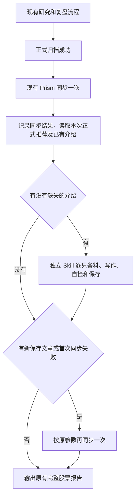

# 公司介绍能力：设计、实施计划与交接验收

状态：已按一次独立审查意见修订，提交用户确认；本文件不表示业务代码已经实施。

适用项目：个人股票分析助手；本地事实仓、现有晚间任务、现有 monitor / Prism。

分工：GLM5.3 按确认后的方案实施；Codex 核查改动、事实、文章和页面。

## 0. 给实施者的执行提示

在用户确认本方案后实施。目标是在正式推荐归档当天，由独立的公司介绍写作能力生成可追溯、可阅读的公司资料，并同步到现有 Prism 的“公司资料”页签。原公司研究 Skill 的职责、发现和验证规则、输出字段及正文要求保持不变。

这是个人助手，不是系统平台。复用已有查询、归档和本地 Web 入口；不增加服务、定时任务、模型进程、任务队列、通用内容框架、审批系统、评分器、文章版本平台或全量数据采集。必要代码围绕本次实际输入和输出编写。介绍生成失败不撤销推荐、不阻断已归档内容的 Web 同步。只修当前范围内的问题。

先核对仓库现状；若与文档存在实质差异，说明差异并局部调整，不恢复历史架构。实施中不改公司研究 Skill 来迁就介绍能力，也不把介绍写入 V4 研究轨迹、Forward CSV 或正式复盘正文。不得把这份方案附带的样例判断当成不需要核实的数据真相。

交付必须包含代码、必要文档、相称测试、三份实际由 AI 撰写的公司介绍、浏览器检查证据及准确的剩余事项。真实样稿、事实输入与截图放在被 Git 忽略的本地产物目录。不得用程序模板拼接三篇文章；不得只交测试通过而没有真实文章和页面验证。

已核实原生任务“A股助手每日研究”读取现有仓库 Prompt，本期不修改原生任务配置或生产模型。首次同步后，仅在新增保存了介绍或首次同步失败时，再同步一次。历史介绍按原 trace 身份和截止备料，不放宽现有晚间严格同步合同。第 15 节记录的独立审查已完成；用户确认后，在本方案范围内实施不例行重复审查。

## 1. 要解决的问题及不解决的问题

### 1.1 用户要得到的结果

陌生读者进入“公司资料”后，能理解公司卖什么、客户为什么需要、收入与利润主要来自哪里、近期经营质量、真实的业务与题材联系、竞争特点及当时估值。介绍有解释力，数据与时点可核对，未知不包装成结论。

正式推荐完成当天应启动该能力；正常情况下，同一晚间任务收尾结束时，Web 已显示新推荐及其完整介绍。介绍可单独阅读，不能要求用户先读推荐研究才能理解。

### 1.2 本期范围

- 新增一个独立、按需调用的介绍 Skill，以及一份运行 Prompt。
- 新增小型只读备料与介绍保存模块，使用现有 ResearchQuery。
- 使用独立本地附属文件保存介绍，不修改正式研究和复盘模型。
- 在现有晚间任务的共同收尾调用介绍能力，并复用现有 Prism 同步命令。
- 扩展展示载荷和“公司资料”页签；兼容已有的简短字符串。
- 验证真实三例、D0 新推荐、重复执行、部分失败和历史回看。

### 1.3 明确不做

- 不改变公司研究 Skill、四专业 Skill、总控的研究判断职责。
- 不新增“第六个选股视角”，不修改 ProfessionalSkillName 等选股枚举。
- 不给介绍增加股票推荐、短期走势、买入条件、仓位或目标价输出。
- 不重写或迁移历史 trace、CSV、snapshot、复盘正文和 D20 结论。
- 不创建新的 Scheduled Task、LaunchAgent、常驻进程或后台队列。
- 不从 Python、浏览器或 Web 渲染器启动模型。
- 不建立全文库、知识图谱、通用 CMS、插件框架或事实评分系统。
- 不新增数据库表，不做正式事实仓 schema / 迁移。
- 不批量补齐全部历史公司，不因为旧介绍缺失而每天重新写全部在跟踪股票。
- 不使用 Sites、Supabase、Cloudflare 或 GitHub Pages 发布。这里的 Web 是现有本地 Prism。

## 2. 已核对的现有实现

以下是 2026-09-08 核对结果；实施者应按函数和语义定位，不依赖固定行号。

| 位置 | 当前行为 | 本次怎么使用 |
|---|---|---|
| `ops/forward-selection-prompt.md` | 正式复盘先保存账本和报告；新选择保存 trace；共同收尾严格同步 Prism，覆盖正常、already_selected、补跑 | 在这个共同收尾接入介绍，不改变研究阶段 |
| `ops/forward-monitor-prompt.md` | 三路互斥、正文唯一保存、D20 冻结 | 保持不变，介绍不是第四种复盘 |
| `forward_selection.selection_output_class()` | 区分 confirmed_active、conditional_event、legacy_v1_not_rewritten、not_formal_candidate | 复用正式身份语义，不只看 final_fate=selected |
| `tools/render_prism_web.py` | 当前晚间三参数严格路径只接受 V4，并要求截止早于行动日零点；另有按已有报告日期渲染的历史路径；旧日期不覆盖新首页 | 两种路径保留原用途；不为旧介绍放宽严格合同，也不把介绍设为正式归档校验的新前置条件 |
| `render_monitor_web.load_d0_entries()` | 只为最新报告从正式 trace 追加 D0；当日 snapshot 可能没有新推荐 episode | 当前 D0 绑定直接使用 trace；历史页只增强其原本展示的记录，不重建历史 D0 |
| `render_monitor_web.build_payload()` | 已按 `(ts_code, action_date)` 保留同股不同次推荐；D0 的 episodeId 可以为空 | 介绍按同一身份绑定，不能以股票代码单独复用 |
| `company_profile_map()` | 公司短句按报告 as_of 读取，可能包含较晚的资料 | 新版介绍独立按原推荐截止冻结；旧短句只作为明确标注的兼容显示 |
| Prism `reviewBody()` | company 页签把 s.company 当纯字符串转义显示 | 增加 companyIntroduction 的小型段落和表格渲染 |
| `ResearchWarehouse(root, read_only=True)` | 已有真正只读打开方式 | 直接使用，不复制旧的绕过构造器方法，不新增只读仓库封装 |
| `ResearchQuery.dataset_partitions_as_of()` | 解析截止时点可见版本及冲突 | 用它取事实，不直接读当前 Parquet 后按日期过滤 |
| `ResearchQuery.comparable_financials_as_of()` | 确定性选择财务报表版本，但内部查询全数据集 | 复用选择规则，日常备料先限定分区；不逐股反复全库扫描，也不把函数名当成经济口径可比的证明 |
| 原生任务“A股助手每日研究” | ACTIVE；已读取 `ops/forward-selection-prompt.md`，并要求执行其中共同收尾 | 本期只接入仓库 Prompt，不修改任务配置、不新建任务、不改变生产模型 |

## 3. 架构选择：独立写作 Skill，复用事实底座

新能力建议命名为 `writing-company-introductions`，路径为：

```text
.agents/skills/writing-company-introductions/SKILL.md
ops/company-introduction-prompt.md
src/stock_analyzer/ops/company_introduction.py
```

文件职责：

- Skill：读者问题、业务解释、证据边界、文风、缺口表达与逐篇自检。
- Prompt：何时调用、采用哪个时间上下文、备料和保存命令、失败后继续 Web 同步。
- Python 模块：身份、只读查询、确定性计算、格式与引用检查、附属文件保存和读取。

原 `researching-company-events/SKILL.md` 不修改。原总控及五个选股 Skill 本期也无需修改；入口由已读取的晚间运行 Prompt 串接。若实施者认为必须改这些 Skill 的研究规则，应先指出真实依赖，不能顺便修改。

独立 Skill 是职责独立，不等于独立模型进程。正常运行仍由现有晚间任务的同一执行者，在正式结果归档后顺序调用。不能要求每天额外启动子智能体或配置 GLM5.3 为生产任务模型。GLM5.3 在本交接中是实施者，生产任务沿用用户现有模型配置。

## 4. 触发机制：先让推荐出现，再补齐介绍

### 4.1 推荐的执行顺序



第一次同步保留现在的收尾动作，使当天新推荐首先可见；没有介绍的记录展示简短缺项说明。随后逐只处理缺失介绍。收尾时，满足“本轮新增保存了介绍”或“第一次同步失败”任一条件，就以相同参数再同步一次；否则不做第二次同步。即使空名单、介绍全部已存在、备料失败或所有文章失败，首次同步失败时仍有这一次恢复尝试。第二次失败后不循环重试。正常一轮结束时，写好的介绍已同步到同一页面。

这两个顺序调用是为解决“介绍写到一半任务中断，正式推荐仍未上 Web”的具体问题，不增加并发、监听、自动刷新或后台任务。页面沿用现有刷新方式。

### 4.2 自动生成的对象

- 以本次已归档的正式 trace 为范围，复用正式输出身份判定。
- 当前 V4 仅处理 `confirmed_active`。
- 原有历史正式类别 `legacy_v1_not_rewritten` 在用户明确要求补写该历史介绍时可处理；按第 4.3 节独立备料，不据此重跑旧研究或扩大到整个历史库。
- 排除 conditional_event、比较股、落选、未决和内部线索。
- 不依赖 monitor snapshot 已经含有该股票：新推荐当天的 D0 往往只有 trace。
- 合法空名单或仅条件事件时不调用写作，Web 正常同步，不能补位。

介绍是正式推荐的后续产物，不参与正式身份判定。新推荐是否成功不能取决于介绍有无、长度或完整度。

### 4.3 already_selected、重跑和补写

- `already_selected` 仍走共同收尾，检查这个原始上下文下的介绍是否已存在。
- 已有有效介绍直接复用，不因当天读到了更多资料或写法可以更漂亮就重写。
- 缺失的介绍才生成；从中断恢复不重新选股、不重跑已保存的介绍。
- 下一晚正常任务只处理下一晚的新正式推荐；本期不自动扫描和补写此前所有缺项。
- 补旧介绍通过介绍模块明确指定原上下文执行；使用原 as_of，不用当前行情。按实际支持的原 trace 版本核对已完成研究和正式身份，不能无条件用 V4 模型解析旧记录。
- 历史 V1 和旧盘前截止不满足当前晚间严格同步的前提，不能为了补介绍放宽 `load_completed_archives()`。不运行正式研究 prepare，不重建研究或复盘归档。
- 需要查看已有历史页面时，复用 `render_prism_web.py --date <已有报告日期>` 的历史渲染路径。隔离检查指定独立输出并使用 `--no-publish`；本次实施验收不覆盖正在使用的历史页面。没有对应报告和 snapshot 时，只验收文章与隔离预览，不补造归档。
- 历史补写只增强该页原本展示的记录，不保证在历史形成日页面重现当时的 D0。页面报告日期可以晚于推荐日期，介绍截止仍采用原推荐值。
- 保留旧日期不替换较新首页的 skipped_newer 规则。历史介绍补写和正常晚间严格同步是两个已有上下文的用法，不增加历史发布流程。

### 4.4 失败行为，保持简单

| 情况 | 行为 |
|---|---|
| 某项非核心资料取不到 | 写已有事实，省略无意义栏目，并在相应位置说明具体未知 |
| 单只无法建立可靠身份或核心业务认识 | 不生成空洞全文，该只保持缺项；继续其他股票 |
| 单篇结构或引用错误 | 本轮修正一次；仍不通过就保留缺项，不循环重试 |
| 写作执行中断 | 首次同步成功时推荐已经可见；同上下文恢复时沿用已有文章、只补缺项并执行同步 |
| 一只失败、其他成功 | 保存成功文章，第二次同步展示成功文章和该只缺项 |
| 第一次 Web 同步失败 | 保留正式研究，仍可生成介绍；无论是否有新文章，收尾按原参数再同步一次 |
| 第二次 Web 同步失败 | 研究和已保存介绍保留；后续只同步 Web，无需再写介绍 |
| 数据有限但正文成立 | 正常保存，不称“完整核验”；以后不自动反复补它 |

不另建错误数据库、错误队列和重试管理器。使用命令结果及现有任务收尾说明。页面的缺项文案应简单，例如“这次推荐的完整公司介绍暂未生成”。不要把介绍缺失写成股票风险。

最终股票报告仍按现有 Prompt 完整输出，不附开发日志。必要时只增加一行实际情况，如“网页已更新；甲公司的完整介绍暂缺：官方业务资料未能取得。”网页失败沿用原错误说明，避免多处重复。

## 5. 写作方法和内容合同

### 5.1 读者目标

文章读完后应能回答：

1. 公司卖什么，谁使用、谁付钱？
2. 业务如何运转，收入和利润受哪些因素影响？
3. 哪块业务贡献规模，哪块业务更影响盈利？
4. 最近经营变化是什么，现金回收与利润是否需要分别理解？
5. 与题材和同行的真实联系是什么，哪些只是储备或投资？
6. 当时有哪些重要事项，市场如何定价，哪些资料仍不明确？

### 5.2 默认阅读顺序

| 部分 | 应写内容 | 可省略或展开的内容 |
|---|---|---|
| 公司定位 | 一句话核心生意、代码和板块，必要的控制关系 | 员工数、上市历史、总部地址不作为必填 |
| 生意如何运转 | 产品或服务、客户、使用场景；有依据的交付和结算特点 | 不照搬工商经营范围，不讲与理解无关的百科 |
| 收入与利润来源 | 主要分部或产品结构；收入与毛利贡献的区别 | 用一套一致分类，避免多张相似表 |
| 近期经营与质量 | 收入、归母、扣非、经营现金流；值得解释的变化 | 指标依业务选择，不强制 EPS、ROE、负债率全上 |
| 业务联系与竞争特点 | 产品对应题材、实际阶段、可比公司的差异 | 无可靠依据不写龙头、份额、排名、星级 |
| 重要事项与估值 | 重要披露的阶段和规模；参考交易日的估值口径 | 不堆例行公告，不预测事件概率或目标价 |

以用户认可的银龙股份样稿作为解释深度参考。建议正文约 800—1600 中文字，并使用少量必要表格；这不是硬性长度校验，业务简单或资料有限时主动缩短。允许标题合并，不要求凑齐六个大块。

### 5.3 每段的写作逻辑

优先采用“事实 → 对理解公司的意义 → 解释边界”，但不要逐段套固定句式。

- 披露事实、公司对经营变化的解释、AI 基于事实的推断，三者在措辞上应分清。
- 不从利润增长直接推导短期股价上涨。
- 不从现金流为正直接推导盈利质量优秀。
- 不从毛利率高直接推导竞争壁垒强。
- 不从研发、专利、产能和产品目录直接推导已经形成大规模收入。
- 不把“公司说持续增长”改写为已证实的增长可持续性。
- 文章要连贯，避免长串术语、宣传语、空洞“受益逻辑”和“基本面支撑”。

### 5.4 业务与题材的映射

只讲与认识公司有关的 2—4 个方向；单一业务公司可以不做映射表。

每个方向尽量说明具体产品、客户或应用场景、已经到达的阶段，以及经营贡献是否可量化。区分：自营/参股、在售/储备、意向/中标/签约/履约/收入确认、小试/规模化。

核电小额外加剂合同不能写成核电主营已经放量；参股航空航天企业不能把被投企业的营业收入并入上市公司主营；工程投资总额不能当作公司收入空间。

### 5.5 同行与行业位置

有必要时选一至两家业务可比公司，先说明可比的产品或环节，再说明不相同的业务组合。同行事实采用同一截止和适当期间；不能拼贴各家公司不同年度的指标作优劣排名。没有可靠份额资料时，用实际产品、客户和工程应用解释位置，或者省略该项。

### 5.6 重要事项

通常选最近定期报告及一至两个实质相关事项，同时保留更早已披露、尚在执行的重要事件。不得用机械“最近 30 天”排除仍有重要影响的重组或长期合同。

同一经济事项的预告、快报、正式报告合并说明披露进展，不计为多个独立利好。只有标题时只确认存在该公告，不补写结果、金额、风险解除或利润贡献。

## 6. 事实取得与时间边界

### 6.1 三个时间角色

- `formation_date`：原研究采用的最后行情日期。
- `action_date`：原推荐所属行动日，用于区分同股不同次推荐。
- `as_of`：原研究精确截止，必须带时区，逐字沿用归档值。
- 另存 `generated_at`：本次实际写作时间，不拿它替换上述截止。

历史记录采用其原始值，不把当前的 18:30 规则强行套回旧记录。所有数值及正文来源必须在原截止可用。估值采用不晚于 formation_date、且在 as_of 可见的实际交易日，正文显示该交易日；D0 图表参考价仍依原合同为空，介绍里的估值参考价格不能写入股票 s.ref。

### 6.2 数据层使用

直接使用 `ResearchWarehouse(read_only=True)` 和 `ResearchQuery`，禁止为介绍运行 data backfill、data health、derive 或研究 prepare。介绍模块的 prepare 是新增的只读备料，不得复用具有写入副作用的正式研究 prepare。

优先取当前问题需要的分区和列：证券身份、公司概况、最新可用定期财务及同口径上年同期、主营、估值、相关公告元数据。不要每次扫描全市场所有财报和公告。

当前 `comparable_financials_as_of()` 内部调用全数据集查询，不是支持单股或分区过滤的接口。备料先限定需要的报告期分区，再筛当前股票，按已有确定性报表优先规则处理；可以在本模块内写小型处理函数，不扩建通用查询框架，也不顺便改事实仓。经济口径是否可比仍需依据报告核对，不能由函数名称担保。

资料不足时可以回退到原截止可用的较早定期报告，但必须写报告期。不能用当前版本的公司简介或后来的指标修订填补历史空白。

### 6.3 官方原文补读

新 Skill 自己拥有介绍所需的定向补读权限，不借修改公司研究 Skill 的 discovery/validation 边界获得权限。

优先沿原截止可见的本地公告元数据链接读取定期报告、实控人说明、合同和业务相关公告。公司主营、客户、控制关系、财务口径或关键未知不足时，可定向补充当时公开的官方文档；必须核对文档身份、公开时间和是否为后续更正版。同行也遵守这一要求。

当前官网文字、新闻汇总和搜索摘要不能直接成为历史介绍的事实。不能仅看 PDF 文件名或搜索引擎日期就声称历史可用。若只能找到后来更新的版本，保留缺口。

本轮只围绕当前介绍的具体缺口进行一次聚焦补证，不批量下载。PDF 在内存或现有临时目录提取所需页，复用已有工具和依赖；不建立永久 PDF/全文库，不安装采集框架。正文所需的出处和少量关键原值保存在介绍来源信息中；未取得正文不得假装已核验。

### 6.4 财务和分类的必要核对

- 归母净利润、合并净利润、毛利分清，不相互替代。
- 经营现金流属于合并报表时，不机械与归母净利润计算所谓质量分数。
- 收入、成本采用同一公司、报告期、合并范围、币种与单位。
- 毛利率按收入与对应成本计算；字段名称包含 profit 不自动等于净利润。
- 产品、地区、行业分类不可混加；汇总行不可和明细相加；同义重复行不强行去重后猜总计。
- 能确定分母才给占比，不能确定则展示金额和限制，不强行补成 100%。
- 同比优先采用可核对的同口径比较。合并范围或重述不明时，不把醒目的增长率配小字脚注；暂不展示同比，说明原因。
- PE/PB 使用原截止可见的来源口径，不用半年利润简单乘二重算 TTM，也不默认为低估。
- 无法显示的字段不是零；缺失、覆盖不足、查询失败、当前快照不可回放和真实无记录分别说明。

## 7. 最小保存合同

### 7.1 一个介绍，一份权威内容

建议默认位置：

```text
local_archive/company_introductions/<action_date>/<ts_code>.json
```

文件是研究归档旁的附属资料，不进入 DuckDB、Forward CSV、V4 trace、monitor snapshot 或复盘模型。`local_archive/` 已被 Git 忽略，实施时核对，不另造索引数据库。

身份使用 `(ts_code, action_date)`，文件内部核对 formation_date 和原 as_of。D0 无 episodeId 也能使用；D1 以后使用原推荐身份找到同一篇。不同次推荐必须各自保存其截止时点的介绍，不能仅按股票代码复用。

### 7.2 推荐的小型 JSON 形状

下列是说明性结构，不是真实公司资料。实现可使用一个轻量模型，不得扩成通用文章协议。

```json
{
  "schema_version": "company-introduction-v1",
  "ts_code": "000001.SZ",
  "name": "示例公司",
  "formation_date": "2026-09-07",
  "action_date": "2026-09-08",
  "as_of": "2026-09-07T18:30:00+08:00",
  "generated_at": "2026-09-07T20:05:00+08:00",
  "sections": [
    {
      "title": "公司定位与主要业务",
      "paragraphs": ["AI 根据来源逐篇撰写的连贯正文。"],
      "source_ids": ["S1"]
    },
    {
      "title": "收入与利润来源",
      "paragraphs": ["解释表格中最值得理解的特点和边界。"],
      "table": {
        "columns": ["业务", "收入", "收入占比"],
        "rows": [["业务甲", "已核实的格式化值", "已计算的格式化值"]],
        "note": "报告期及必要口径说明"
      },
      "source_ids": ["S2"]
    }
  ],
  "sources": [
    {
      "id": "S1",
      "kind": "official_document",
      "title": "公司定期报告",
      "available_at": "2026-08-20T00:00:00+08:00",
      "availability_basis": "官方披露条目的时间及具体定位；此处为结构示意",
      "retrieved_at": "2026-09-07T19:40:00+08:00",
      "url": "https://example.invalid/illustrative-report.pdf",
      "locator": "业务说明所在页",
      "report_period": "2026-06-30"
    },
    {
      "id": "S2",
      "kind": "warehouse",
      "title": "本地时点主营数据",
      "available_at": "2026-08-21T00:00:00+08:00",
      "dataset": "main_business",
      "report_period": "2026-06-30",
      "locator": "能够定位此次使用的公司、分类和原始行"
    }
  ],
  "limitations": ["确实存在而且有意义的资料限制"]
}
```

只有段落和普通表格两种正文内容，不引入递归块、任意 HTML、富文本编辑器、组件注册或文章插件。sections 是唯一正文；不同时维护另一份自由修改的 Markdown 正文和 HTML 正文。需要给用户复制或导出时由相同 sections 确定性排版。

来源信息只保留核对必要内容。定向补读的官方文档必须记录公开时间依据的具体定位和本次 retrieved_at，以免把补读时间与历史公开时间混淆。引用关键数值时，来源信息中记录所引原值及必要计算说明，以便与备料或官方原文对应；本地来源保留数据集和原始行定位。无需建立逐字标注系统或完整事实关系图。

### 7.3 保存、复用与修改

- 保存前验证股票和原推荐时间，来源 ID 存在，本地来源与本轮备料相符，来源不晚于 as_of，基本结构和表格列数正确；具体输入见第 8.2 节。
- 正文中的数值准确性、业务解释和推断边界由写作自检及验收核查，不声称结构校验已经证明语义正确。
- 已有有效同身份文件直接复用；不得每次执行都改 generated_at 或改写正文。
- 普通写入使用现有项目风格的临时文件加原子替换，避免半份 JSON；只为本次单文件保存服务，不再加锁服务、事务平台或版本清单。
- 不自动覆盖存在但身份冲突或格式损坏的文件；明确指出该具体文件，Web 继续显示缺项。人工明确要求修正时再做局部修正，不用整套回滚系统。
- 不新增每篇文章的哈希、配套 checksum 或总 manifest。既有查询与存储自带的哈希照常保留和复用。

## 8. 最小备料、保存和调用接口

建议一个模块、两个正式流程命令，加一个只读单股入口；若相同能力能在两个命令内清楚表达，可合并，不能为减少名字牺牲职责清晰。

### 8.1 `prepare`：本次正式介绍范围及备料

```text
python -m stock_analyzer.ops.company_introduction prepare
  --formation-date <F> --action-date <A> --as-of <S>
```

只读取得正式 trace 并核对 F/A/S；返回本次正式股票、已有可复用介绍、缺失项及写作所需的精简事实与来源。保持原正式顺序，不打分。按现有可支持的 trace 版本和正式分类读取；历史 V1/盘前截止不能被强制送入当前晚间严格同步校验。

输出 JSON 到标准输出；命令本身不改研究或事实仓。调用者将本轮输出保存为临时 facts-file，供写作和 record 核对，可由本轮数篇文章共用。使用现有本地临时工作目录，不另造缓存系统；它不是第二份正文或永久证据库。

事实计算给出原值、单位、可复制的格式化结果和必要口径说明。AI 负责选择和解释，不重新心算金额、占比或同比。

### 8.2 `record`：单篇保存

```text
python -m stock_analyzer.ops.company_introduction record
  --intro-file <AI 撰写的单篇 JSON>
  --facts-file <本轮 prepare 输出 JSON>
```

从内容获得身份，并重新对照对应正式 trace、原时间和现有正式分类，校验后写默认附属位置。核对逻辑支持已确认范围内的历史正式记录，不无条件用 V4 模型解析历史。未完成正式研究、仅 pending trace、非正式候选不得通过生产 record；中国船舶 conditional_event 样稿仍只走隔离验收。结果至少区分本次保存、已有复用和具体失败。不新增“审批通过”状态，不要求用户逐篇批准日常文章。

对文章引用的本地来源，将 source_id、数据集、原始行定位、available_at 及所引关键原值与 facts-file 对应。不重新扫描整库，也不只比较文章自己填写的日期。

定向新补读的官方来源保存在文章 sources 中，记录官方出处、公开时间依据的具体定位、实际 retrieved_at 和所引关键原值。AI 检查原文及版本；程序只检查必要信息、引用关联和截止关系，不声称自动证明官方文档历史真实性。无法核实的来源不支撑正文事实。不建立覆盖所有自然语言陈述的判定器。

### 8.3 单独介绍与验收入口

用户明确指定股票介绍时，允许只读入口提供 `--code`、带时区 `--as-of` 和 `--price-date`，输出该公司的备料，不要求它是正式推荐。

这一路不进入生产 record，也不把样稿装入正式股票列表。三例验收文章写入单独被忽略的验收目录，再交给隔离的页面预览。首版不用为单股介绍增加新的归档系统。

## 9. Web 接入

### 9.1 展示载荷

在 `build_payload()` 给每个已展示股票增加可选 `companyIntroduction`，来自第 7 节文件；旧 `company` 字段保留兼容。原正式 snapshot 文件不增加字段，扩展仅发生在展示载荷。

复用同一只读加载函数处理 D0 和后续 episode。需要的原 as_of：D0 来自本次 trace，后续来自 episode 的 source_as_of 或其对应原 trace。无法证明身份匹配时返回介绍缺失，而不是加载同代码最新的一篇。

介绍始终显示为“推荐时点资料”；滑动价格/复盘时间轴不改介绍内容或截止时间。后补介绍可显示实际编写时间，避免使读者误以为正文推荐当天就已经存在。

历史页面重渲染可以读取后来补写、但事实严格截至原推荐的文章；这是补充资料，不是历史原稿回放。必须保留实际编写时间，不把正文后补时间倒填。只增强该页已展示的记录，不修改“仅最新报告追加 D0”的现有规则；原推荐和 D20 原文不变。隔离验收使用已有历史渲染路径或独立预览，不放宽晚间严格同步合同。

### 9.2 简单渲染

优先渲染新版 sections；段落按原文，普通表格按列和行显示，来源可展开。复用现有文字转义和链接处理，只接受普通安全链接；不加载通用 Markdown/富文本库，不开放原始 HTML。

没有新版介绍但有旧 company 字符串时继续显示，并注明“旧快照中的简要资料；完整推荐时点介绍暂缺”。没有任何内容时显示缺项文案，不能补“主营不明”或空泛公司描述。

新介绍不显示原来的“未做最新公告或财务核验”统一页脚。应显示实际资料截止、报告期、来源和存在的限制，不宣称全面核验所有公告。

### 9.3 最小外观要求

- 延续现有颜色、字体、面板和页签，不改整体页面设计。
- 桌面表格清晰；手机表格在自身容器内横向滚动，不撑破页面。
- 段落有适当间距，标题不密集重复；来源和辅助身份信息可折叠。
- 不改原推荐、复盘、图表、筛选、收藏、回放和同股多次推荐的既有交互。
- 不新增实时更新、自动轮询、云端接口或追踪代码。

## 10. 给 GLM5.3 的分步实施计划

### 步骤 1：核对基线与写清局部执行提示

读取 AGENTS、当前架构、本方案、晚间两个 Prompt，以及本方案点名的函数。查看 git status，保留他人改动和已有 tmp 内容。已核实 ACTIVE 任务“A股助手每日研究”读取该仓库 Prompt，本期不修改原生任务配置、不创建任务、不改变生产模型；若实施时发现入口已变，报告具体差异，不据此扩大到任务配置改造。

对本方案覆盖的时点、附属保存和共同收尾变更，按仓库规则完成一次独立方案审查。若交接前本方案已经有明确的独立通过结论且范围未变，复用该结论，不例行再审；实质超出通过范围的高风险部分停止并说明。审查者不实施、不继续委派。

### 步骤 2：实现只读事实与附属文件最小闭环

新增 company_introduction 模块，复用现有只读仓库、时点查询和正式身份函数，完成：

1. 本次正式范围解析，含空名单、already_selected、D0 和不同 trace 版本的历史原截止；与晚间严格同步校验分清。
2. 先限定必要分区，再按股票取得事实和确定性计算；不逐股调用全库财务查询。查询失败按股票/资料块隔离，身份无法核对才停止该篇。
3. 轻量结构与来源对应检查，record 明确接收本轮临时 facts-file；官方来源保留公开时间依据与实际补读时间。
4. 单篇保存、已有复用及按原推荐身份读取。

不顺便改财务数据治理、日历、公司概况采集或正式记录逻辑。当前查询能力不足时先缩小介绍内容，不用本任务修整套底座。

### 步骤 3：实现独立 Skill 和运行 Prompt

Skill 只定义本方案写作方法与来源边界，不能照抄公司研究 Skill 的选股问题。Prompt 写清备料→定向补读→逐篇 AI 写作→数值和来源自检→record，以及失败继续下一篇。

原公司研究 Skill 和总控 Skill 不改。按仓库现有 Skill 规范提供必要的发现元数据，只有仓库已有同类要求时才增加 agents 配置文件，不额外创建技能包框架。

### 步骤 4：接入展示载荷与公司资料页签

在 build_payload 同时覆盖 D0 与后续记录；给 Prism 增加局部 renderer 和样式。保留旧字段兼容，保证同股两次推荐读取各自文章。不要为了长介绍而改 formal snapshot、ResearchThesis 或 report 模型。

先用少量合成资料验证段落、表格和缺项表现，再验证真实文章。旧 monitor 页面继续能使用 company 简要字符串；本期不改其整体布局。

### 步骤 5：接入现有共同收尾

在 `ops/forward-selection-prompt.md` 的归档后共同收尾实现第 4 节顺序：保留首次同步并记录结果；调用独立介绍 Prompt；有新保存文章或首次同步失败时再次同步。没有新文章也不能漏掉首次失败后的这一次恢复；第二次失败不循环重试。

显式覆盖正常新选股、already_selected、人工补跑、合法空名单、单篇失败、第一次/第二次同步失败与中断恢复。不得把介绍写进正式推荐正文，也不把介绍错误变成研究错误。现有三项时间参数逐字传递。

### 步骤 6：执行相称测试和三例真实写作

先运行第 11 节针对性自动测试；通过后生成第 12 节三篇真实文章，逐篇检查来源和解释，再在隔离页面做浏览器检查。发现实际问题再局部修复并重测受影响部分，不循环运行全部测试。

### 步骤 7：文档与交接

更新当前架构的公司介绍与本地呈现说明；更新 Prism 数据接口说明，必要时给 AGENTS 增加一句独立介绍入口及非选股边界，不能改写原五 Skill 的职责。新增事实档案仍位于 local_archive，被 Git 忽略。

交接时列出实际修改文件、测试命令与结果、三篇全文位置、对应来源和核对结果、隔离页面及截图位置、剩余问题。明确原生任务配置未改，仅接入仓库 Prompt。不写“全部正确”这类无证据结论。用户未要求提交/推送时，不自行提交、推送、部署或修改正在使用的历史正式产物。

## 11. 自动测试与运行验证矩阵

不对简单文案写大量镜像测试；以下测试覆盖的是会造成错误公司、未来数据、历史污染或 Web 不更新的实际问题。

| 类别 | 必测行为 |
|---|---|
| 正式范围 | confirmed_active 纳入；conditional/比较/落选排除；legacy 按既有语义；空名单不补位 |
| D0 | 当日 snapshot 没有新 episode 也可从正式 trace 生成、绑定和展示介绍 |
| 日期 | 跨周末、补跑和旧盘前截止沿用原值；历史 V1 可以按原身份备料，不被强送晚间严格同步；无时区拒绝；UTC 转北京时间不显示错一天 |
| 历史事实 | 后续财务修订不被使用；快照不可回放与真实无记录分开；不读未来价格 |
| 确定性计算 | 金额单位、占比、同口径毛利；总计/明细/产品地区交叉不重复加总；负值和缺失保留真实含义 |
| 财务可比性 | 不可比同期不生成同比；毛利贡献不当归母贡献；半年利润不乘二生成 TTM |
| 来源 | source_ids 可解析；本地来源与临时 facts-file 不符时拒绝保存；官方历史公开时间与实际补读时间分别保留；没有正文不伪造正文事实 |
| 保存 | 首次保存；同身份复用且不改生成时间；另一次推荐单独保存；结构坏或身份冲突不冒充有效篇 |
| 不污染 | 备料/record 不改公司研究 Skill、正式 trace、CSV、复盘和事实仓；利用临时目录和少量文件内容比较验证，不新增校验文件体系 |
| 失败隔离 | 一只失败其他保存；介绍缺失不阻断严格 Web 同步；同步失败后文章仍在 |
| 两次同步 | 首次成功即有新推荐；新增介绍或首次失败触发第二次同步；首次失败且没有新文章也重试一次；首次成功且无新增则不再同步 |
| 历史首页 | 只增强原页面已有记录，不重建历史 D0；补旧日期仍 skipped_newer；隔离验收不覆盖现用页面，也不放宽严格同步条件 |
| 兼容 | 新字段缺失时旧 company 可读；D0 ref 仍为空；同股两次推荐、现有回放与筛选不变 |
| 文本呈现 | 字符转义、表格对齐、长中文、缺项、手机滚动与来源链接不破坏既有页面 |

优先扩展或复用已有测试文件：

```text
tests/test_company_introduction.py                 # 新增，限本能力
tests/test_render_monitor_web.py
tests/test_render_prism_web.py
tests/test_prism_web_contract.py
tests/test_forward_monitor_prompt.py              # 只在其实际覆盖收尾语义时扩展
tests/check_prism_web_browser.py                  # 复用浏览器检查方式，别另造框架
```

同时运行与改动相邻的正式选择和复盘回归，确认身份和输出未回退。不要把浏览器截图替代功能断言，也不要把 pytest 通过替代文章核查。

浏览器至少检查：正常完整篇、数据有限篇、缺介绍、同股两次推荐、D0、旧 company；桌面和手机各检查一次。可在一次紧凑预览中合并这些场景，不做大规模截图矩阵。

## 12. 三例真实验收合同

### 12.1 共用执行要求

- 由 AI 按新 Skill 逐篇撰写，不使用公司名分支或程序模板生成正文。
- 真实输入、文章、预览及核对记录建议置于 `local_archive/company_introduction_validation/`，不写正式研究，不自动上生产首页。
- 保留本轮实际 facts-file 供核查，并分别记录官方来源历史公开时间与实际补读时间。旧盘前案例不送入晚间三参数严格同步；有可用历史报告时按第 4.3 节隔离渲染，否则只做文章及独立预览。
- 先读各自原始 trace 确认时点。下面的日期是定位锚点，不可用它们替代现场核对；历史数据变化要依据原截止解释，不为匹配本文而硬编码值。
- 中国船舶的正文能力测试和正式纳入测试分开；不因为用户要求此案例而改变其原有身份。
- 以同一新 Skill 生成的文章作为验收对象，不直接复制本次对话里已有样板。

### 12.2 银龙股份 603969.SH：解释业务结构

定位：`research-trace-2026-08-20.json`；原行动日 2026-08-21，原截止 `2026-08-21T09:10:00+08:00`，目前为 legacy_v1_not_rewritten。

核查重点：

1. 读者能理解预应力材料和轨道制品/装备/服务的区别，以及产品使用场景。
2. 分部口径含其他收入，不能与产品明细口径拼接。核对约八成材料收入、两成轨道收入及轨道约四成毛利贡献的原始数据和公式。
3. 区分毛利、归母净利润和经营现金流；解释利润改善时同时交代现金回收仍需观察。
4. 高铁、水利、风电/光伏、核电和参股航空航天的联系按真实阶段写，不把小合同或投资写成成熟主营。
5. 实控人、公司全称采用截止前可靠来源，不能直接沿用已陈旧的简介文字。
6. 财务数字和表格由原截止查询和官方报告核对；不能照抄对话里的四舍五入数字来通过检查。

### 12.3 中国船舶 600150.SH：处理不可比和历史版本

定位：`research-trace-2026-09-02.json`；原行动日 2026-09-03，原截止 `2026-09-03T09:09:50+08:00`。当前 selection_output_class 为 conditional_event。

执行方式：作为用户指定的单股介绍样稿进入隔离验收，不能通过生产自动 record 混入正式推荐 Web。必须另有测试证明自动范围将其排除。

核查重点：

1. 不能把存在合并/重述疑点的收入、归母增长率作为已确认同比。
2. 原截止的 financial_indicator 若无可用行，不能使用后续修订版本；可由当时已可用利润表计算的毛利率单独说明。
3. 简介中历史遗留的柴油机定位不能覆盖当期主营构成；公司简介快照日期与业务统计日期分开。
4. 合同公开/可用时间按时区核对，不把 9 月 3 日北京时间事实显示成 9 月 2 日；合同金额不等于当期利润。
5. 本期金额、同比、ROE、负债率各自核实，不能因一项不可用而删除所有财务，也不能统一标成已核验。
6. 能写出有帮助的介绍，同时把不可比较和无法回放的具体部分留下，不伪造结论。

### 12.4 海油工程 600583.SH：业务集中、表达克制

定位：`research-trace-2026-08-21.json`；原行动日 2026-08-24，原截止 `2026-08-23T09:05:02+08:00`，目前为 confirmed_active。

以业务较集中的工程服务公司验证简洁性。执行时先核对截止前业务分部；如果实际资料显示业务并不适合该定位，说明事实后选一个确实业务单一的真实公司，不能预设结论。

核查重点：

1. 讲清海洋油气工程设计、建造、安装等服务与客户需求，不能只列工商经营范围。
2. 不因为“油气”标签把公司写成直接靠原油销售赚钱。
3. 有来源才讲项目执行、收入确认和回款特征；不拿别家工程公司的惯例当它的事实。
4. 主营集中时允许一个主业务表或简短描述，不硬凑多个业务/题材/同行栏目。
5. 行业排名、实控人细节或某些业务收入缺失时，省略次要项或准确说明；不能用宣传语补缺。

此外，用一个小型合成缺失输入测试“只有可靠身份和主营、没有可比财务”时的行为。明确它是合成测试，不把人为删掉的材料宣称为真实仓库缺失，也不把它替代上面的三篇真实文章。

## 13. Codex 后续核查方式

GLM5.3 完成后，Codex 按四个层次核查，发现问题给出具体文件、输入和改法：

1. **职责和范围**：公司研究 Skill 是否保持原职责；是否新增不必要服务、抽象或机制；正式选择/复盘是否被意外改变。
2. **事实和时点**：抽查三例关键数字、实际备料、来源、版本、可比性、身份和估值交易日。重点复核中国船舶时点及分类，区分历史公开与实际补读时间；不能只复看实施者的总结。
3. **文字和认识**：从陌生读者角度逐篇读全文，核对生意、规模、盈利质量、业务关系及未知；查找未经支撑的宣传语和推断。
4. **运行和页面**：验证 D0 当天可见、首次同步失败且没有新文章仍恢复一次、恢复只补缺项、失败隔离、旧页不覆盖新首页、同股两次推荐和手机表格；核对历史介绍没有触发旧研究重建或放宽严格同步合同。

最终结论可以是完成、需局部修正或真实阻塞；不打综合分，不创建评分器或额外审批流程。结构测试通过但文章有硬伤时，明确文章仍不通过；文章写得好但自动触发或 Web 未接通时，也不能称完成。

## 14. 交接清单和停止条件

GLM5.3 交付时应提供：

- 修改范围与逐文件用途，说明为什么每项新增是必要的。
- 实际测试命令及结果，未执行项如实说明。
- 三篇全文及其原截止、实际备料、关键来源和数值核对记录；官方历史公开与实际补读时间可区分。
- 页面预览和桌面/手机检查结果。
- 一次新推荐 D0 链路、一次 already_selected 恢复、一次介绍失败后 Web 正常更新、首次同步失败且没有新文章仍恢复一次的证据。可合并使用隔离的合成归档验证机制，不能伪造真实自动任务完成。
- 对公司 Skill、正式 trace、Forward CSV、复盘和 D20 未被改写的核对。
- 原生任务配置未改的说明；本期仅接入现有仓库 Prompt。

遇到缺失依赖、数据冲突或自动任务入口不符合假设时，完成不受影响部分并报告具体问题。不得为让交付看起来完整而扩大架构、偷偷改原截止、放松正式身份或套用未来资料。

最终验收标准：陌生读者理解了这家公司；数字与时点可以核对；解释有依据；未知没有包装成结论；正式推荐当天触发并正常同步到现有 Web；该能力没有侵入公司研究 Skill 的本职工作。

## 15. 方案审查记录

2026-09-08，已按仓库要求完成恰好一次独立上下文审查。结论：**通过（以修订版为准）**。

审查确认独立 Skill、附属 JSON、同一任务顺序收尾及局部页面渲染足够，原公司研究 Skill 保持不变。本文件已合入要求的修订：

1. 第二次同步统一采用“新增文章或首次同步失败”的条件。
2. 历史介绍按原 trace 版本、身份和截止处理，不放宽现有晚间严格同步，不重建历史 D0。
3. 财务备料先限定分区，避免逐股反复全库扫描。
4. 保存以本轮临时 facts-file 核对本地来源；官方来源分开记录公开时间依据和实际补读时间。
5. 已确认现有原生任务读取仓库 Prompt，本期不改任务配置。
6. 相应情形并入已有验收，不增加另一套测试或审批体系。

用户确认后，GLM5.3 可在此范围内复用本次审查结论实施，不例行再审。本次只交付方案文档，尚未实施业务代码、核验三例最终数据或生成三篇验收产物。
