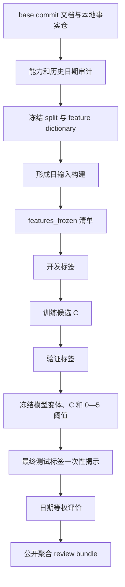

# Selection Lab 与机会类型研究合同设计

**日期：** 2026-08-17
**基线：** `ad7d1385dbeb1c91771af66a3294da74b857c2b0`
**正式合同：** `docs/selection_lab/2026-08-17-selection-lab-and-opportunity-type-execution-prompt.md`

## 1. 结论

新增一个与正式数据任务和五 Skill 日常研究隔离的 `selection_lab`。它把形成日输入、未来标签、时间切分、基线、简单逻辑回归、机会类型审计和公开审阅包拆成独立步骤，以清单哈希约束标签揭示顺序。

本地能力预检已经确定：当前没有机器可读且在未来揭示前冻结的完整 `candidate_chain`，冻结日期又早于 `security_master` 首次可用时间。因此本轮主轨实验必须结论为 `实验阻塞`，隐性公司 Gate 为 `not_evaluable`。实现仍完整交付，使以后新增真实冻结候选链后能沿用同一合同运行；次级确定性研究表面只用于验证数据和模型管道，不能冒充主轨。

## 2. 比较过的实现方式

### 方式 A：只实现候选链主轨

优点是边界最窄，不会误用次级数据。缺点是当前主轨为零，无法验证标签、排序、时间切分和报告管道的实际协作，后续取得候选链时仍可能暴露大量接口问题。

### 方式 B：先做完整范围回测器

优点是可立即得到大量样本。缺点是冻结日期缺少时点安全证券身份、ST 和完整排除能力，会把身份不完整的报价集合冒充完整合格范围，违反研究边界。

### 方式 C：轨道感知的隔离实验室（采用）

统一接口承载三条轨道，但由能力审计决定哪些评价合法：

- `frozen_candidate_chain`：唯一主轨；
- `deterministic_research_surface`：身份不完整的次级探索；
- `full_universe`：只有时点身份能力完整时启用。

这种设计能如实交付当前阻塞结论，同时把未来可用的实验基础设施、测试和审阅格式一次建立好，不恢复旧评分器或生产选股器。

## 3. 模块边界

```text
src/stock_analyzer/selection_lab/
├── __init__.py              # 公开版本和少量导出
├── schemas.py               # 枚举、不可变样本/标签/能力/清单模型
├── temporal_split.py        # 交易日、行动日、标签末日、split 与揭示状态
├── labels.py                # 统一复权入口、可执行性和 20 日路径标签
├── opportunity_types.py     # 三类机会合同、分配校验与 sole-gate 判定
├── feature_builder.py       # 特征白名单、禁用字段、训练矩阵和预注册字典
├── dataset_builder.py       # 轨道输入、血缘、能力审计和本地产物编排
├── baselines.py             # 随机及四个简单排序基线
├── ranker.py                # 两个 L2 逻辑回归、模型/C/阈值冻结
├── evaluation.py            # 日期等权 Precision/Lift/Brier/bootstrap/路径指标
├── audit.py                 # 日期污染、候选链、Gate、敏感数据和 Git 范围审计
└── reporting.py             # 确定性 JSON 与 review bundle
```

文件按业务职责拆分。数据获取仍通过现有 `ResearchQuery` 和 `ResearchWarehouse`，不复制事实仓、修订解析或数据任务。

## 4. 核心数据模型

### 4.1 样本键

唯一键为 `(research_track, formation_date, ts_code)`。同一形成日所有股票只能属于同一 split。

### 4.2 能力状态

每个轨道返回结构化状态：

```yaml
status: available | unavailable | blocked
reason_code: ""
details: []
```

没有主轨时不是空的 0% 结果，而是 `unavailable/no_frozen_candidate_chain`。缺历史身份时 `full_universe` 为 `blocked/point_in_time_security_master_unavailable`。

### 4.3 形成日输入与未来标签物理分离

形成日样本和标签分别写入本地 Parquet/JSON，并各自生成 SHA-256。最终测试特征在打开标签时不可重写。清单记录：

```text
features_frozen
development_labels_opened
validation_labels_opened
final_test_labels_opened
```

`final_test` 标签命令只有在 split、特征字典、模型变体、C 和阈值冻结哈希均存在且匹配时才能运行。

## 5. 数据流



主轨不可用时，B 立即把主业务结论固定为 `实验阻塞`，但 C—L 的合同、帮助命令、合成测试和不可评价输出仍可生成。

## 6. 日期和泄漏控制

日期完全沿用正式 Prompt 的 30/10/10 清单。代码从交易日历重算每个行动日和第 20 日，并强制：

```text
max(development.label_end) < min(validation.formation_date)
max(validation.label_end) < min(final_test.formation_date)
```

历史日期扫描读取 `git show ad7d138:<path>` 的 base commit 内容，不扫描本轮新文件。扫描器先识别日期，再结合邻近标题/字段判定它是否实际作为 formation date、验证/留出/确认、已揭盲未来或普通业务日期出现；原始证据位置写入清单。

任何可能进入模型的预处理对象只在训练 split 拟合。行动日可执行性和标签不能进入特征或用于 Top-K 递补。

## 7. 机会类型

类型分配输入是形成日冻结的因果命题和证据，而不是数值特征自动阈值。分配器提供严格校验：

- `company_catalyst` 必须有直接公司变化；
- `sector_diffusion` 必须有历史成员、板块扩散和同类增量，不要求新公司公告；
- `independent_price_anomaly` 必须完成相对市场/同类、成交推进、流动性、透支和假突破检查，不要求公司催化；
- 无因果命题时允许 null；
- 输入含未来标签键时拒绝执行；
- 一个主要类型、零个或多个不重复次要类型。

`sole_company_gate_rejection` 只有对完整主轨候选链且四项条件同时成立时计算；无主轨输出 null，不从历史报告补造。

## 8. 特征和模型

### 8.1 特征

`feature_dictionary.json` 把正式 Prompt 的通配白名单展开为精确列。每列记录公式、窗口、来源、时点规则、缺失语义和用途。股票代码、AI fate、行动日可执行性、未来数据、研究文本量和证据数量在矩阵构建前被拒绝。

公司事件类型/阶段作为基础分类特征；机会类型只加入“含类型模型”。两个模型其余样本、列和预处理完全一致。

### 8.2 模型

使用 scikit-learn 可选依赖：训练中位数插补并添加缺失指示、标准化、分类最频值插补和 unknown-safe one-hot，接 L2 `liblinear` 逻辑回归。C 只比较 `0.1/1/10`。

验证集按日期等权 `policy Precision@5`、Brier、较小 C 选参。含类型模型只有至少提高 2 个百分点且 Brier 不差时胜出，否则选无类型模型。最终模型在开发加验证重拟合后只评价一次最终测试。

### 8.3 0—5 只

验证集只比较 0.10—0.90、步长 0.05 的固定阈值。每日最多 5 只，不补位。阈值必须满足至少 7 个非空验证日和至少 20 个选择；否则状态为 `not_supported`。

## 9. 评价

日期内先算 `effective_k=min(K,n)` 的 Precision，再对形成日等权。主指标使用不递补不可执行股票的 `policy Precision@K`；辅助报告原 Top-K 内的 `executable Precision@K`。

同时报告候选池基础率、AI 入选/淘汰、简单基线、Top 5 与剩余候选、Brier、固定分箱校准、路径质量、机会类型分组和形成日 bootstrap。并列用带种子的哈希键，不用股票代码顺序。

当前主轨为零时，主轨指标为 null，结论为 `实验阻塞`；次级轨指标单列且不得升级主结论。

## 10. CLI 和本地产物

CLI 子命令只做显式步骤：

```text
build-dataset
audit-opportunity-types
evaluate-baselines
train-ranker
walk-forward
build-review-bundle
```

命令不联网、不隐式运行正式数据任务。能力不足时输出机器可读 reason code 并以非零退出；`build-review-bundle` 可把阻塞状态写成公开聚合文件。

完整数据和模型只写：

```text
local_warehouse/selection_lab/
local_archive/selection_lab/
local_models/selection_lab/
```

Git 只保存小体量清单、聚合指标、有限示例、系数和验证记录。

## 11. 错误处理

- 时间无时区、分区缺失、复权不一致、标签窗口不完整：失败关闭或标签 null；
- 主轨文件不完整、无法证明冻结：整日不进入主轨，并记录原因；
- 训练只有一个类别：`not_trainable`，不伪造模型；
- 无合格阈值：`zero_to_five_status: not_supported`；
- 无主轨：排序和 Gate 分别为 `实验阻塞`、`not_evaluable`；
- 缺 scikit-learn：模型命令非零，数据/审计命令仍可用；
- review bundle 检出本地绝对路径、Token 或过大逐股数据：拒绝写出。

## 12. 测试策略

严格 TDD。测试分为：

- 合同：枚举、机会类型、禁用字段、能力状态；
- 时间：行动日、第 20 日、两个窗口不重叠、揭示门禁；
- 标签：第 3/21 日、收盘而非最高、复权、不可执行不递补；
- 数据：`available_at`、身份回放、形成日/标签分离和清单哈希；
- 模型：训练期拟合、两模型唯一差异、固定种子、并列、C/变体/阈值冻结；
- 评价：日期等权、空日期/null、policy/executable 口径、bootstrap；
- 审计：base commit 日期扫描、自污染、Gate 不可评价、敏感内容；
- CLI：六个帮助入口和结构化失败；
- Skill：frontmatter、机会类型输出合同和语义边界；
- 全量回归：`python -m pytest -q` 和 `git diff --check`。

## 13. Skill 修正

在实验输入冻结后，四个指定 Skill 增加机会类型合同。修改只让板块扩散和独立价格异常使用各自证据标准，消除文字上的隐性公司必要条件；不改变候选数量、固定评分、Gate 或收益规则。

由于当前没有主轨 Gate 审计，报告必须写：这是语义和职责修正，不是已经确认的历史误杀修复，也不是已经通过未来收益验证的改进。

## 14. 验收

- 正式 Prompt、设计、split、历史日期清单和特征字典在标签前冻结；
- selection_lab 代码、六个 CLI、TDD 测试和可选依赖存在；
- 四个 Skill 和架构/README 同步；
- review bundle 对不可评价项使用 null 和 reason code；
- 全量测试、CLI help、重复性、Skill 校验、敏感内容和 `git diff --check` 有新鲜证据；
- 本地事实、完整样本、逐股预测、模型二进制、Token 和用户目录不进入 Git；
- 分支推送并创建 draft PR，若认证仍失效则保留本地提交并准确报告阻碍。
